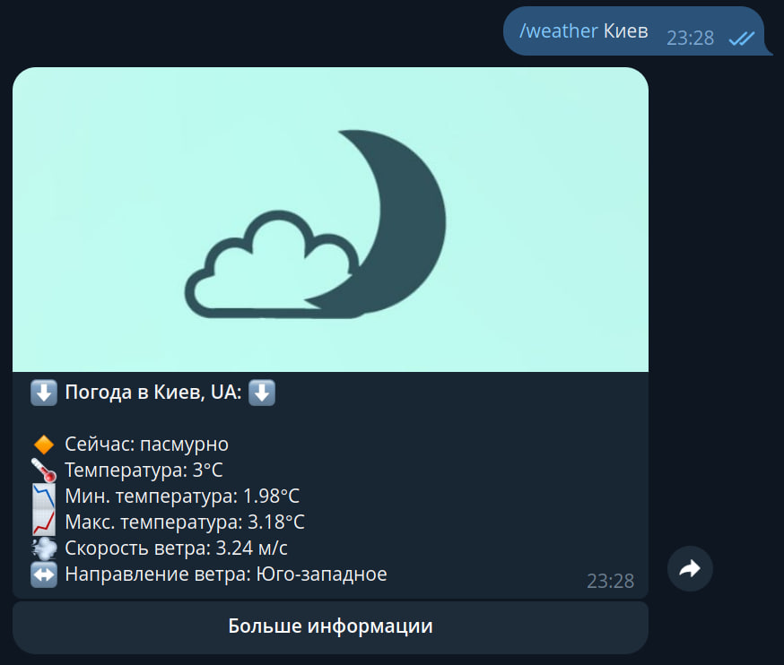

<h1 align="center"><em>Telegram bot Weather</em></h1>

<p align="center">
<a href="https://www.python.org/downloads"></a>
<a href="https://core.telegram.org/bots/api"></a>
<a href="https://openweathermap.org/api">
    
</a>
</p>

## 🤖 Bot Overview

🌟 **Telegram bot Weather** is a universal assistant that can show you the weather forecast in any city on the planet at any time.

### ☀️ Beautiful design
- The bot has a beautiful and easy-to-use interface (more to come)

### 🖥️ Ability to make weather forecasts 4 days ahead (16 days ahead in the next update)
- The bot shows the weather forecast for 4 days ahead at 3 hour intervals


## 🚀 Getting Started

### Working with Git

If you don't have Git installed, you can download it [here](https://git-scm.com/downloads).

1. **Clone the Repository:**
    ```bash
    git clone https://github.com/Dobryaakk/Weather.git
    ```

2. **Navigate to the Project Directory:**
    ```bash
    cd Weather
    ```


## 🌍 Environment variables

|  Variables  | Description            |
|:-----------:|------------------------|
| `API_TOKEN` | Telegram bot API token |
|   `APPID`   | ID owm                 |


## 🔧 Tech Stack

-   `aiogram` — asynchronous framework for Telegram Bot API
-   `requests` — library for making HTTP requests in Python
-   `loguru` — project logging


## 📢 Contact

[Dmytro](https://github.com/Dobryaakk): dobryyaakk@gmail.com
